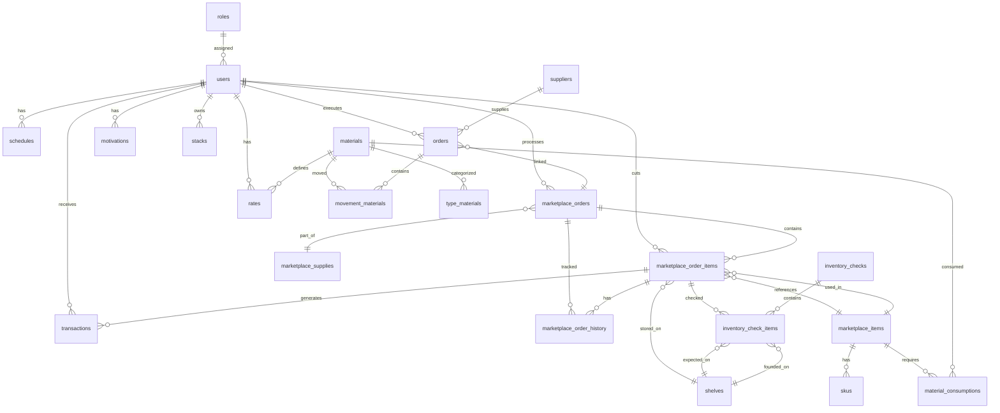

# Схема базы данных

## Визуальное представление связей между таблицами

## Группы таблиц по функциональности

### 1. Управление пользователями

- **users** - Основная информация о пользователях
- **roles** - Роли пользователей
- **schedules** - Графики работы

### 2. Маркетплейсы и заказы

- **marketplace_orders** - Заказы с маркетплейсов
- **marketplace_order_items** - Элементы заказов
- **marketplace_items** - Товары
- **marketplace_order_history** - История изменений
- **marketplace_supplies** - Поставки
- **skus** - Артикулы товаров

### 3. Материалы и склад

- **materials** - Материалы
- **type_materials** - Типы материалов
- **movement_materials** - Движения материалов
- **material_consumptions** - Расход материалов
- **suppliers** - Поставщики
- **shelves** - Стеллажи
- **stacks** - Стопки материалов

### 4. Производство

- **orders** - Производственные заказы
- **inventory_checks** - Инвентаризации
- **inventory_check_items** - Элементы инвентаризации

### 5. Финансы и мотивация

- **transactions** - Финансовые транзакции
- **rates** - Ставки оплаты
- **motivations** - Мотивационные бонусы

### 6. Системные таблицы

- **settings** - Настройки
- **cache** / **cache_locks** - Кэш
- **jobs** / **job_batches** / **failed_jobs** - Очереди задач

## Основные связи

### Пользователи и заказы

- Каждый пользователь может обрабатывать множество заказов
- Заказ может быть назначен конкретному пользователю

### Заказы и материалы

- Каждый заказ требует определенных материалов
- Материалы могут использоваться в多个 заказах

### Финансы

- Транзакции привязаны к пользователям и элементам заказов
- Ставки определяются пользователем и материалом
- Мотивация зависит от объема выполненных работ

### Складской учет

- Товары хранятся на определенных стеллажах
- Инвентаризация проверяет фактическое местоположение

## Особенности архитектуры

1. **Soft delete** используется в таблицах:
    - users
    - materials
    - suppliers

2. **Каскадное удаление** настроено для:
    - Связей пользователей с расписаниями
    - Элементов заказов с историей
    - Поставок с заказами

3. **RESTRICT** используется для предотвращения случайного удаления:
    - Пользователей с транзакциями
    - Материалов с движениями

Эта структура обеспечивает полный цикл управления производственным процессом от
заказа до оплаты.
