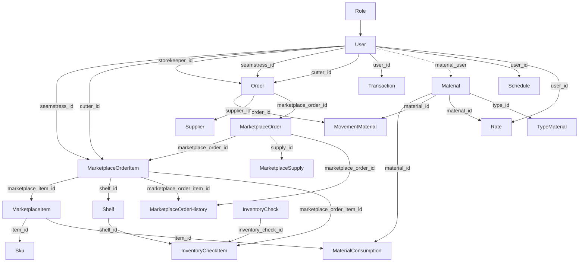

# Связи между моделями Laravel приложения

*Дата создания: 05.12.2025*

## Обзор архитектуры связей

Приложение содержит 26 моделей с различного типа связями. Основные
бизнес-процессы включают:

- Управление заказами с маркетплейсов (Ozon, Wildberries)
- Отслеживание перемещений материалов
- Учет работы сотрудников (швеи, раскройщики, кладовщики)
- Финансовые транзакции и мотивация

## 1. Модуль пользователей и ролей

### User (Пользователь)

**Основная модель для управления сотрудниками**

- **role** → Role (BelongsTo)
    - Внешний ключ: `role_id`
    - Обратная связь: `users` (HasMany)

- **marketplaceOrderItems** → MarketplaceOrderItem (HasMany)
    - Внешний ключ: `seamstress_id`
    - Обратная связь: `seamstress` (HasOne)

- **marketplaceOrderItemsByCutter** → MarketplaceOrderItem (HasMany)
    - Внешний ключ: `cutter_id`
    - Обратная связь: `cutter` (HasOne)

- **materials** → Material (BelongsToMany)
    - Промежуточная таблица: `material_user`
    - Обратная связь: `users` (BelongsToMany)

### Role (Роль)

**Определяет права доступа пользователя**

- **users** → User (HasMany)
    - Внешний ключ в User: `role_id`
    - Обратная связь: `role` (BelongsTo)

## 2. Модуль маркетплейсов и заказов

### Marketplace (Маркетплейс)

**Константы для маркетплейсов (Ozon, WB)**
*Не имеет явных связей через Eloquent*

### MarketplaceOrder (Заказ маркетплейса)

**Основная сущность заказов с маркетплейсов**

- **items** → MarketplaceOrderItem (HasMany)
    - Внешний ключ: `marketplace_order_id`
    - Обратная связь: `marketplaceOrder` (BelongsTo)

- **supply** → MarketplaceSupply (BelongsTo)
    - Внешний ключ: `supply_id`
    - Обратная связь: `marketplace_orders` (HasMany)

- **history** → MarketplaceOrderHistory (HasOne)
    - Внешний ключ: `marketplace_order_id`
    - Обратная связь: `order` (BelongsTo)

### MarketplaceOrderItem (Элемент заказа)

**Детализация заказа с привязкой к исполнителям**

- **marketplaceOrder** → MarketplaceOrder (BelongsTo)
    - Внешний ключ: `marketplace_order_id`
    - Обратная связь: `items` (HasMany)

- **item** → MarketplaceItem (HasOne)
    - Внешний ключ: `marketplace_item_id`
    - Обратная связь: `marketplaceOrderItem` (HasMany)

- **seamstress** → User (HasOne)
    - Внешний ключ: `seamstress_id`
    - Обратная связь: `marketplaceOrderItems` (HasMany)
    - Включает `withTrashed()` для доступа к удаленным пользователям

- **cutter** → User (HasOne)
    - Внешний ключ: `cutter_id`
    - Обратная связь: `marketplaceOrderItemsByCutter` (HasMany)
    - Включает `withTrashed()` для доступа к удаленным пользователям

- **shelf** → Shelf (BelongsTo)
    - Внешний ключ: `shelf_id`
    - Обратная связь: `orderItems` (HasMany)

- **history** → MarketplaceOrderHistory (HasMany)
    - Внешний ключ: `marketplace_order_item_id`
    - Обратная связь: `item` (BelongsTo)

### MarketplaceItem (Товар маркетплейса)

**Каталог товаров**

- **marketplaceOrderItem** → MarketplaceOrderItem (HasMany)
    - Внешний ключ: `marketplace_item_id`
    - Обратная связь: `item` (HasOne)

- **sku** → Sku (HasMany)
    - Внешний ключ: `item_id`
    - Обратная связь: `item` (BelongsTo)

- **consumption** → MaterialConsumption (HasMany)
    - Внешний ключ: `item_id`
    - Обратная связь: `item` (BelongsTo)

### Sku (Артикул)

**Связь товаров с маркетплейсами**

- **item** → MarketplaceItem (BelongsTo)
    - Внешний ключ: `item_id`
    - Обратная связь: `sku` (HasMany)

### MarketplaceSupply (Поставка маркетплейсу)

**Управление поставками**

- **marketplace_orders** → MarketplaceOrder (HasMany)
    - Внешний ключ: `supply_id`
    - Обратная связь: `supply` (BelongsTo)

### MarketplaceOrderHistory (История заказов)

**Журнал изменений статусов**

- **item** → MarketplaceOrderItem (BelongsTo)
    - Внешний ключ: `marketplace_order_item_id`
    - Обратная связь: `history` (HasMany)

- **order** → MarketplaceOrder (BelongsTo)
    - Внешний ключ: `marketplace_order_id`
    - Обратная связь: `history` (HasOne)

## 3. Модуль материалов и склада

### Material (Материал)

**Основная сущность материалов**

- **type** → TypeMaterial (BelongsTo)
    - Внешний ключ: `type_id`
    - Обратная связь отсутствует

- **movementMaterials** → MovementMaterial (HasMany)
    - Внешний ключ: `material_id`
    - Обратная связь: `material` (BelongsTo)

- **users** → User (BelongsToMany)
    - Промежуточная таблица: `material_user`
    - Обратная связь: `materials` (BelongsToMany)

- **rates** → Rate (HasMany)
    - Внешний ключ: `material_id`
    - Обратная связь: `material` (BelongsTo)

### TypeMaterial (Тип материала)

**Классификатор типов материалов**
*Не имеет явных связей*

### MovementMaterial (Перемещение материалов)

**Учет движения материалов по складу**

- **material** → Material (BelongsTo)
    - Внешний ключ: `material_id`
    - Обратная связь: `movementMaterials` (HasMany)

### MaterialConsumption (Расход материалов)

**Нормы расхода материалов на товары**

- **item** → MarketplaceItem (BelongsTo)
    - Внешний ключ: `item_id`
    - Обратная связь: `consumption` (HasMany)

- **material** → Material (BelongsTo)
    - Внешний ключ: `material_id`
    - Обратная связь отсутствует

### Shelf (Полка)

**Места хранения на складе**

- **orderItems** → MarketplaceOrderItem (HasMany)
    - Внешний ключ: `shelf_id`
    - Обратная связь: `shelf` (BelongsTo)

## 4. Модуль внутренних заказов и перемещений

### Order (Внутренний заказ)

**Заказы на перемещение материалов**

- **user** → User (BelongsTo)
    - Внешний ключ: `storekeeper_id`
    - Обратная связь отсутствует

- **seamstress** → User (BelongsTo)
    - Внешний ключ: `seamstress_id`
    - Обратная связь: `marketplaceOrderItems` (HasMany)

- **cutter** → User (BelongsTo)
    - Внешний ключ: `cutter_id`
    - Обратная связь: `marketplaceOrderItemsByCutter` (HasMany)

- **movementMaterials** → MovementMaterial (HasMany)
    - Внешний ключ: `order_id`
    - Обратная связь: отсутствует

- **supplier** → Supplier (BelongsTo)
    - Внешний ключ: `supplier_id`
    - Обратная связь: `orders` (HasMany)

### Supplier (Поставщик)

**Справочник поставщиков**

- **orders** → Order (HasMany)
    - Внешний ключ: `supplier_id`
    - Обратная связь: `supplier` (BelongsTo)

### TypeMovement (Тип перемещения)

**Классификатор типов перемещений материалов**
*Не имеет явных связей*

### StatusMovement (Статус перемещения)

**Классификаторы статусов для заказов**
*Не имеет явных связей*

## 5. Модуль финансов и мотивации

### Transaction (Транзакция)

**Финансовые операции с сотрудниками**

- **user** → User (BelongsTo)
    - Внешний ключ: `user_id`
    - Обратная связь отсутствует

### Rate (Ставка)

**Тарифные ставки сотрудников**

- **material** → Material (BelongsTo)
    - Внешний ключ: `material_id`
    - Обратная связь: `rates` (HasMany)

### Motivation (Мотивация)

**Настройки мотивации сотрудников**
*Имеет только поля user_id без связи*

## 6. Вспомогательные модули

### InventoryCheck (Инвентаризация)

**Контрольные инвентаризации склада**

- **items** → InventoryCheckItem (HasMany)
    - Внешний ключ: `inventory_check_id`
    - Обратная связь отсутствует

### InventoryCheckItem (Элемент инвентаризации)

**Результаты инвентаризации**

- **expectedShelf** → Shelf (BelongsTo)
    - Внешний ключ: `expected_shelf_id`
    - Обратная связь отсутствует

- **foundedShelf** → Shelf (BelongsTo)
    - Внешний ключ: `founded_shelf_id`
    - Обратная связь отсутствует

- **marketplaceOrderItem** → MarketplaceOrderItem (BelongsTo)
    - Внешний ключ: `marketplace_order_item_id`
    - Обратная связь отсутствует

### Schedule (График)

**График работы сотрудников**

- **user** → User (BelongsTo)
    - Внешний ключ: `user_id`
    - Обратная связь отсутствует

### Stack (Стек)

**Очереди заданий для швей**
*Имеет только поля user_id без связи*

### Setting (Настройка)

**Системные настройки приложения**
*Не имеет связей*

## Визуальная схема связей



## Ключевые потоки данных

### 1. Процесс выполнения заказа

```
MarketplaceOrder
    ↓
MarketplaceOrderItem (назначается seamstress и cutter)
    ↓
Order (внутренний заказ на материалы)
    ↓
MovementMaterial (списание материалов)
```

### 2. Процесс расчета финансов

```
MarketplaceOrderItem
    ↓
Transaction (начисление за выполнение)
    ↓
Rate (использование ставок по материалам)
```

### 3. Процесс инвентаризации

```
InventoryCheck
    ↓
InventoryCheckItem (проверка каждого товара)
    ↓
MarketplaceOrderItem + Shelf (сверка мест хранения)
```

## Особенности реализации

1. **Мягкое удаление**: User, Material, Supplier используют SoftDeletes
2. **Доступ к удаленным**: В связях seamstress и cutter используется
   `withTrashed()`
3. **Многие-ко-многим**: User и Material связаны через промежуточную таблицу
4. **Полиморфные связи**: Не используются в приложении
5. **Вычисляемые поля**: Модели используют accessor для форматирования данных
6. **Константы**: StatusMovement и TypeMovement хранят константы статусов

## Критичные связи для бизнес-логики

1. **User → MarketplaceOrderItem**: Назначение исполнителей на заказы
2. **MarketplaceOrderItem → Shelf**: Отслеживание мест хранения
3. **Material → MovementMaterial**: Контроль остатков материалов
4. **MarketplaceOrderItem → Transaction**: Финансовый расчет
5. **MarketplaceItem → MaterialConsumption**: Нормирование расхода материалов
