# Dependency Graph & God Nodes
> Auto-generated by `php artisan wiki:generate` — DO NOT edit manually
> Score = indegree*2 + outdegree. Indegree = сколько классов зависят от данного.

## Top 10 God Nodes

| Rank | Class                                 | Type       | Indegree | Outdegree | Score |
|------|---------------------------------------|------------|----------|-----------|-------|
| 1    | **MarketplaceApiService**             | service    | 25       | 6         | 56    |
| 2    | **UserService**                       | service    | 18       | 2         | 38    |
| 3    | **MarketplaceOrderService**           | service    | 16       | 0         | 32    |
| 4    | **MarketplaceOrderItemService**       | service    | 12       | 3         | 27    |
| 5    | **TgService**                         | service    | 13       | 0         | 26    |
| 6    | **MarketplaceSupplyController**       | controller | 0        | 22        | 22    |
| 7    | **TransactionService**                | service    | 9        | 0         | 18    |
| 8    | **MovementMaterialToWorkshopService** | service    | 5        | 4         | 14    |
| 9    | **InventoryService**                  | service    | 6        | 0         | 12    |
| 10   | **ShiftService**                      | service    | 6        | 0         | 12    |

## Dependency Graph (Top 5 God Nodes + их соседи)

```mermaid
graph TD
    AutoOrderService["AutoOrderService"]
    TgService["TgService"]
    UserService["UserService"]
    DefectMaterialService["DefectMaterialService"]
    MarketplaceApiService["MarketplaceApiService"]
    MarketplaceOrderItemService["MarketplaceOrderItemService"]
    MarketplaceOrderService["MarketplaceOrderService"]
    StickerService["StickerService"]
    StackService["StackService"]
    TransactionService["TransactionService"]
    MarketplaceSupplyService["MarketplaceSupplyService"]
    MovementDefectMaterialToSupplierService["MovementDefectMaterialToSupplierService"]
    MovementMaterialToWorkshopService["MovementMaterialToWorkshopService"]
    WarehouseOfItemService["WarehouseOfItemService"]
    BarcodeSearchController("BarcodeSearchController")
    HomeController("HomeController")
    MarketplaceApiController("MarketplaceApiController")
    MarketplaceOrderController("MarketplaceOrderController")
    MarketplaceOrderItemController("MarketplaceOrderItemController")
    MarketplaceSupplyController("MarketplaceSupplyController")
    MovementMaterialToWorkshopController("MovementMaterialToWorkshopController")
    SettingController("SettingController")
    StickerPrintingController("StickerPrintingController")
    SupplyBoxController("SupplyBoxController")
    TelegramController("TelegramController")
    UsersController("UsersController")
    WarehouseOfItemController("WarehouseOfItemController")
    AutoOrderService -.->|static| TgService
    AutoOrderService -.->|static| UserService
    DefectMaterialService -.->|static| TgService
    DefectMaterialService -.->|static| UserService
    MarketplaceApiService -.->|static| MarketplaceOrderItemService
    MarketplaceApiService -.->|static| TgService
    MarketplaceApiService -.->|static| UserService
    MarketplaceApiService -.->|static| MarketplaceOrderService
    MarketplaceApiService -.->|static| StickerService
    MarketplaceOrderItemService -.->|static| MarketplaceApiService
    MarketplaceOrderItemService -.->|static| StackService
    MarketplaceOrderItemService -.->|static| TransactionService
    MarketplaceSupplyService -.->|static| MarketplaceApiService
    MovementDefectMaterialToSupplierService -.->|static| TgService
    MovementDefectMaterialToSupplierService -.->|static| UserService
    MovementMaterialToWorkshopService -.->|static| TgService
    MovementMaterialToWorkshopService -.->|static| UserService
    StackService -.->|static| MarketplaceOrderItemService
    UserService -.->|static| TgService
    WarehouseOfItemService -.->|static| MarketplaceApiService
    BarcodeSearchController -.->|static| MarketplaceApiService
    HomeController -.->|static| MarketplaceOrderItemService
    HomeController -.->|static| MarketplaceOrderService
    MarketplaceApiController -.->|static| MarketplaceApiService
    MarketplaceOrderController -.->|static| MarketplaceOrderService
    MarketplaceOrderItemController -.->|static| MarketplaceOrderItemService
    MarketplaceOrderItemController -.->|static| MarketplaceApiService
    MarketplaceSupplyController -.->|static| MarketplaceOrderService
    MarketplaceSupplyController -.->|static| MarketplaceApiService
    MarketplaceSupplyController -.->|static| TgService
    MovementMaterialToWorkshopController -.->|static| TgService
    MovementMaterialToWorkshopController -.->|static| UserService
    SettingController -.->|static| TgService
    SettingController -.->|static| MarketplaceApiService
    StickerPrintingController -.->|static| MarketplaceOrderItemService
    StickerPrintingController -.->|static| UserService
    StickerPrintingController -.->|static| MarketplaceApiService
    SupplyBoxController -.->|static| UserService
    TelegramController -.->|static| TgService
    TelegramController -.->|static| UserService
    UsersController -.->|static| UserService
    UsersController -.->|static| TgService
    WarehouseOfItemController -.->|static| MarketplaceOrderService
    WarehouseOfItemController -.->|static| MarketplaceApiService
    WarehouseOfItemController -.->|static| MarketplaceOrderItemService
    style MarketplaceApiService fill:#ffe066,stroke:#333,stroke-width:2px
    style UserService fill:#ffe066,stroke:#333,stroke-width:2px
    style MarketplaceOrderService fill:#ffe066,stroke:#333,stroke-width:2px
    style MarketplaceOrderItemService fill:#ffe066,stroke:#333,stroke-width:2px
    style TgService fill:#ffe066,stroke:#333,stroke-width:2px
```

## Graph Statistics

- **Total Nodes:** 64
- **Total Edges:** 132
- **DI Edges:** 0 (constructor dependencies)
- **Static Call Edges:** 132 (Service::method calls)
- **Avg Edges per Node:** 2.06
